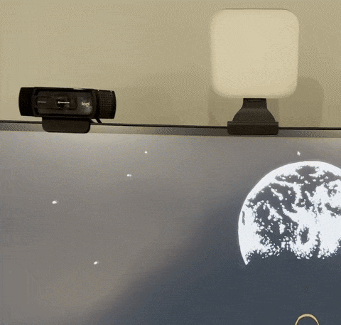
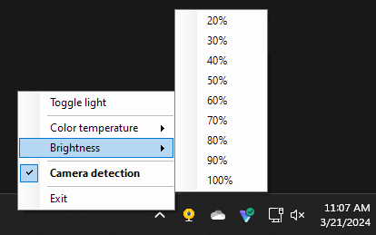

# Features
**⭐ Automatically toggle on/off your Logitech Litra USB device when your webcam is in use.** Works for any app, like Teams, Zoom, OBS, etc.

**⭐ Control the Litra color temperature, brightness, and manual on/off via the systray icon.** You can also disable the automatic camera detection feature if you'd like.

# Requirements
* Windows PC (tested on Windows 11). This will not work on Mac or other platforms.
* [Node.js](https://nodejs.org/en/download) installed on PC with node.exe as part of your %PATH% variable (this happens by default when installing node)

> Note: you do NOT need the Logitech Litra software installed for this to work.

# Installing
1. `git clone https://github.com/mikepaer/litra-automation`
2. `cd litra-automation`
3. `npm install`

## Running
Run `launcher-windowless.vbs` to start the program. 
> Note: you can start the program automatically at system boot by creating a shortcut to `launcher-windowless.vbs` and putting it in your `Startup` folder.

All `launcher-windowless.vbs` does is run the node script (`node app.js`) in a way that suppresses the command prompt.

> ❗ Important note: the first time you run this script, you may be prompted to install .NET framework. The app will crash without it. Accept the prompt and install it, then re-run the app. This is necessary for the systray aspect of the app.

# How this works
### Detecting camera use
Windows records when your webcam starts/ends use on a per-app basis to the registry (`HKEY_CURRENT_USER\SOFTWARE\Microsoft\Windows\CurrentVersion\CapabilityAccessManager\ConsentStore\webcam\*`). When the `LastUsedTimestamp` QWORD value is set to `0x0`, that implies the camera is in use.

This app simply polls the registry every 1.5s to see if any `LastUsedTimestamp` is `0x0` and infers that the webcam is in use. When `LastUsedTimestamp` changes to anything else, it infers the webcam is no longer in use. 

### Other libraries in use
* Interfacing with the Litra light: https://github.com/timrogers/litra
* Creating a systray icon and menu: https://github.com/zaaack/node-systray
